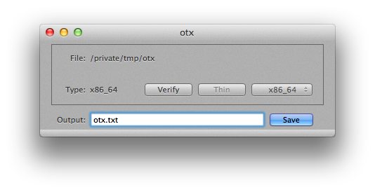

otx
===

The Mach-O disassembler.

[Bug report and feedback][] | [Follow Me on Twitter (@x43x61x69)][] | [Blog (Chinese)][]

[Bug report and feedback]: https://github.com/x43x61x69/OTX/issues "GitHub"
[Follow Me on Twitter (@x43x61x69)]: https://twitter.com/x43x61x69 "Twitter"
[Blog (Chinese)]: http://vox.vg "Blog"

Description
-----------

This is an updated version of the original otx, which has the following new features:

* Works with new otool came with Xcode 4.2 and above.
* Source compatible with Xcode 5 and above.
* Based on 10.9 SDK.
* 64bit binary.
* All APIs up-to-date.
* Minor bugs fix.
* Pre-compiled binaries included.

Changelog
---------

Build 564:

* No more symbolic link.
* Minor UI fix.

Build 563:

* Minor UI updates.

Build 562:

* Update base SDK to 10.9 and Xcode 5.1.

Build 561:

* Initial release.

License
-------

The otx project and all original otx source files are in the public domain.
